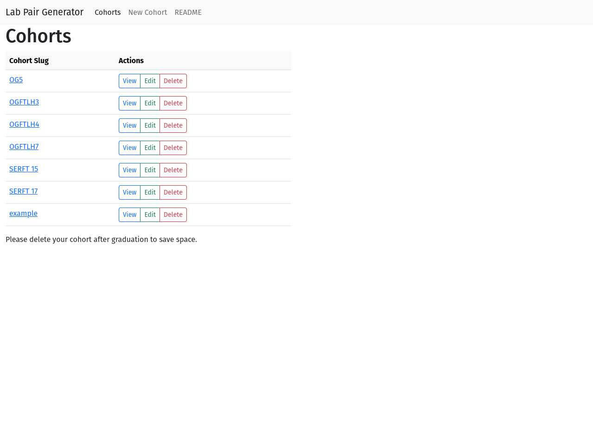
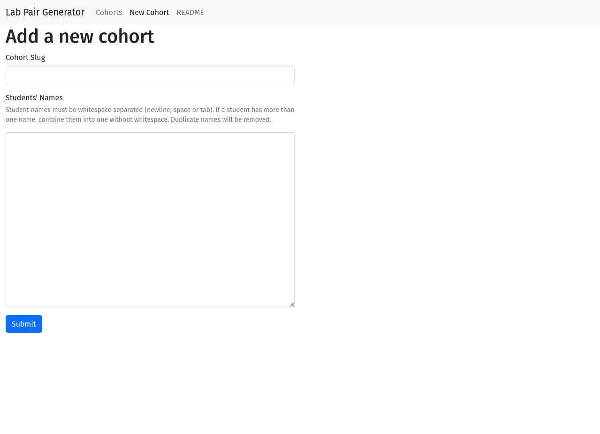
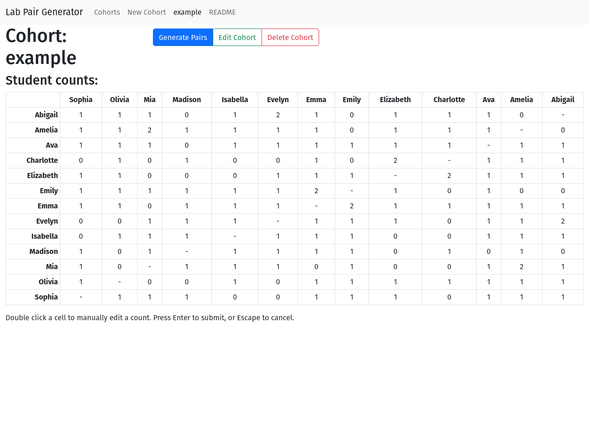
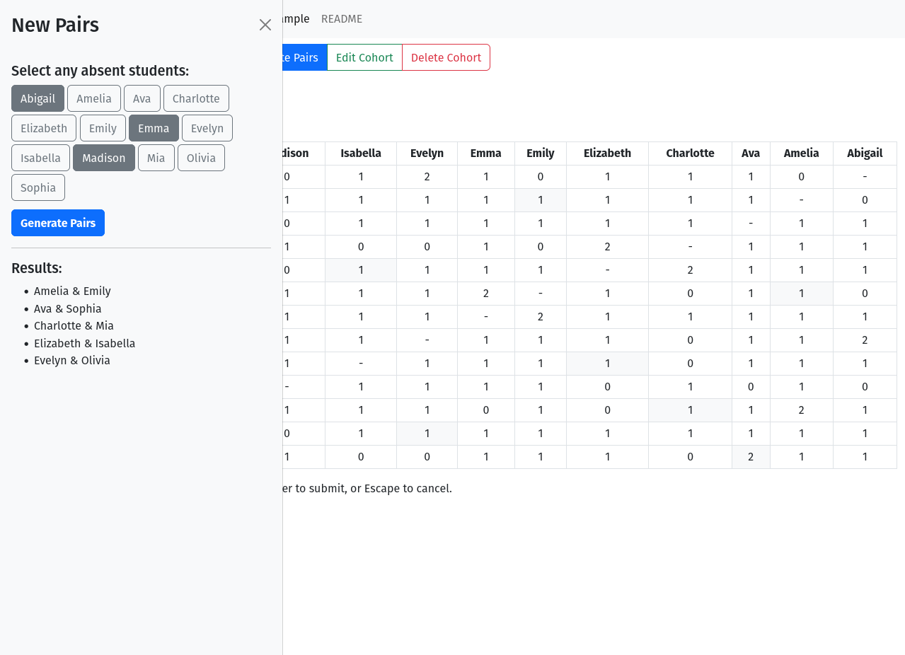

# Lab Pair Generator

Creates randomized pairs of students.

## The Problem

1. Creating random pairs of students multiple times in a row often results in
many repeat pairings before everyone has had a chance to work with everyone
else.

2. Absent students shouldn't be included in any of the pairs for the day.

3. If there's an odd number of students there should be one group of three.

4. Data should be kept separate for each cohort/class.

## The Solution

1. For each student, keep track of the number of times they've been paired with
every other student and use that number as a weight in the random pair
selection process.

2. A set of unavailable students is added to as the pairs are being generated,
so absent students can be added to the set before selection even begins.

3. The group of three is chosen first. First, the student with with smallest
sum of total past pairings is selected. This student is likely to be the one
who has been in the fewest groups of three so far (though they could also have
been absent the most). Then, a partner for the first student is found by the
normal, weighted method. Finally, a third student is found based on the lowest
sum of past pairings for the whole group of three.

4. An instance of the custom `Cohort` class is created for each cohort/class,
which has methods for generating pairs as well as persisting the data via
`pickle`.

## The Application

This project started in the `main` branch, but has since been broken into
two parts:

For the CLI tool, check out the
[:twisted_rightwards_arrows: cli branch](https://github.com/caseinpoint/lab_partners/tree/cli)

For the web app, check out the
[:twisted_rightwards_arrows: webapp branch](https://github.com/caseinpoint/lab_partners/tree/webapp)

You can see the web app deployed on pythonanywhere
[here](http://caseinpoint.pythonanywhere.com/). :bangbang: Please note that
this tool may still be in use by others, so only mess around with the
[example cohort](http://caseinpoint.pythonanywhere.com/cohorts/example), or
[create a new one](http://caseinpoint.pythonanywhere.com/new). Thanks!

## Web App

### Technologies

- Python3
- [Flask](https://flask.palletsprojects.com/en/2.2.x/) web server framework
- [Jinja2](https://jinja.palletsprojects.com/en/3.1.x/) templating engine
- JavaScript
- [Bootstrap](https://getbootstrap.com/docs/5.2/getting-started/introduction/)
CSS and JS library
- Deployed on [pythonanywhere](https://www.pythonanywhere.com/) (see above)

### Description

Built upon the original CLI tool, users of the web app have access to all
functionality in a simple, easy to use UI.

From the home page, users can directly access most features:

Creating a new cohort.

Viewing cohort details and counts of past pairings. This page has several JS
files for improving user interaction, and sending data to the server
asynchronously.

Generating new pairs on the cohort details page. This is handled with async JS
and server side Python functions.

Editing a cohort.

Deleting a cohort.
